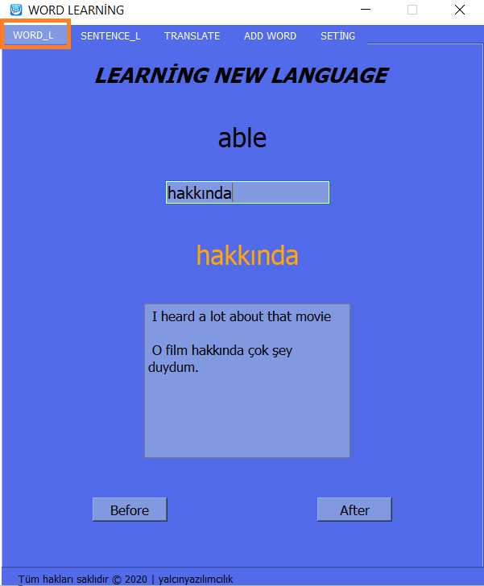

# *PROJE ADI : LEARNİNG NEW LANGUAGE*

 </img>
<a src="show/sunum_learning.mp4"> videoya burdan ulaş </a>

 

### Python kullanarak oluşturduğum bu uygulama, yeni bir dil öğrenmeyi hem eğlenceli hem de istikrarlı bir şekilde devam ettirmenizi sağlayacak.
<i>This application I have created using Python will allow you to learn a new language in a fun and consistent manner.</i>

 

### Eğer projeyi biraz daha detaylı anlatırsak; projede kullanıcının kendini geliştirebileceği özelliklere sahip bir arayüz bulunmaktadır. Bu özellikler arasında kelime öğrenme, cümle kurmayı öğrenme, kelimenin anlamını bulma ve öğrenmek istediği yeni kelimeler yer almaktadır. Ayrıca, kullanıcıyı belirli zaman aralıklarında istikrarlı bir şekilde kelime öğreten bir başka arayüz de mevcuttur.

<i>If we explain the project in a bit more detail; the project includes an interface with features that allow the user to improve themselves. These features include learning new words, learning sentence construction, finding the meaning of a word, and learning new words that the user wants to learn. Additionally, there is another interface that consistently teaches the user words at certain intervals.</i>

 
 

# **PROJENİN TANITIMI**

 

### **HİDDEN SCREEN**

 

 </img>

 Bu pencere arayüzünde kelime bilginizi belirli aralıklarla disiplinli bir şekilde geliştiriyoruz. Bu arayüz, belirli bir zaman aralığında size önemli kelimeleri gösterir ve kelime haznenizi ölçer. Bildiğiniz kelimeleri veritabanı sisteminden siler, böylece yeni kelimeleri daha fazla öğrenme şansı elde edersiniz. Bu özelliğin iki modu bulunmaktadır: standart mod, kelime öğretirken sizi çok zorlamadan ilerlerken; zorlu mod ise kelimeleri öğrenmeniz için sizi zorlar. Ana menüden bu modlar arasında geçiş yapabilirsiniz.

<i>In this window interface, we enhance your vocabulary knowledge in a disciplined manner at specific intervals. This interface shows you important words within a certain time frame and measures your word repository. If you know the words, they are removed from the database system, encouraging you to learn new words more effectively. This feature has two modes: the standard mode teaches words without exerting too much pressure, while the challenging mode pushes you to learn words by challenging you. You can switch between these modes in the main menu.</i>

  

### **MAİN SCREEN**

Ana arayüzde, kelime öğrenme, cümle yapısını öğrenme, aramak istediğimiz kelimenin anlamını bulma, yeni bir kelime eklemek ve arayüzlerin ayarlarını kontrol etmek için hem gizli arayüzü hem de ana arayüzü kontrol edebileceğimiz bir bölüm bulunmaktadır. Bu bölümde toplamda 5 sekme bulunmaktadır. Sırasıyla kontrol edecek olursak

<i>In the main interface, there is a section where we can control both the hidden interface and the main interface. In this section, there are 5 tabs where we can learn words, learn sentence structures, find the meaning of a word, add a new word we want to learn, and control the settings of the interfaces. If we go through them in order:</i>

  

### **2.1 )  WORD LEARNİNG**

 </img>

 Bu sekmede, gizli arayüzdeki gibi kelime öğrenmek için geliştirilmiş bir bölüm bulunmaktadır. Burada kullanıcı isteğine bağlı olarak istediği kadar kelime arasında geçiş yapabilir ve kelime haznesini geliştirebilir.

<i>"In this tab, there is a section specifically designed for learning words, just like in the hidden interface. Here, the user can switch between words as desired and improve their word repository</i>

                          

### **2.2 ) SENTENCE LEARNİNG**

 </img>

 Bu sekmede, cümle öğrenmek için geliştirilmiş bir bölüm bulunmaktadır. Burada kullanıcı isteğine bağlı olarak istediği kadar cümle arasında geçiş yapabilir ve cümle yapılarına alışkanlığını geliştirebilir.

<i>This tab features a section specifically designed for learning sentences. Here, the user can switch between sentences as desired and improve their familiarity with sentence structures.</i>

  
                          

### **2.1 ) TRANSLATE**

 </img>

 Kullanıcının bilmediği kelimeleri araştırmak ve öğrenmek için geliştirilmiş bir site bulunmaktadır. Bu araştırmayı iki yönlü olarak gerçekleştirebilirsiniz; hem Türkçe'den İngilizce'ye hem de İngilizce'den Türkçe'ye.

<i>There is a website developed for researching and learning unfamiliar words for the user. You can perform this research in both directions; from Turkish to English and from English to Turkish.</i>

                    
      
### **2.1 ) ADD WORD**

 </img>

 Kullanıcının bilmediği kelimeleri veritabanı sistemine ekleyip bunları öğrenmesini sağlamak için geliştirilen bir arayüzdür.

<i>It is an interface developed to allow the user to add unfamiliar words to the database system and facilitate their learning.</i>

                    
            

### **2.1 ) ADD WORD**

 </img>

 Kullanıcının hem ana menüyü hem de gizli menüyü kontrol etmesini sağlamak için oluşturulan bir bölümdür. Bu bölümde kullanıcı, arayüzü istediği gibi şekillendirebilir.

<i>It is a section created to enable the user to control both the main menu and the hidden menu. In this section, the user can customize the interface according to their preferences.</i>

